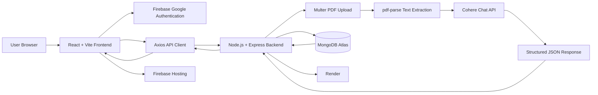

# AI Resume Analyzer

A full-stack **MERN + Cohere AI Resume Screening Platform** that lets users sign in with Google, upload a PDF resume, paste a job description, and receive an AI-generated **resume match score (0-100)** with concise feedback.

The application includes user authentication, resume analysis, analysis history, an admin dashboard, MongoDB persistence, protected frontend routes, production deployment, and temporary-file cleanup.

## Live Deployment

- **Frontend (Firebase Hosting):** https://ai-resume-analyzer-456c7.web.app
- **Backend API (Render):** https://ai-resume-analyzer-api-anhm.onrender.com
- **GitHub Repository:** https://github.com/kuldeepjhorar40/AI-resume-analyser

> Render's free instance may sleep after inactivity, so the first backend request can take longer than usual.

## Project Overview

The main goal of this project is to automate the first stage of resume screening.

A user:

1. Signs in using Google through Firebase Authentication.
2. Uploads a PDF resume.
3. Pastes a job description.
4. The frontend sends the resume, job description, and MongoDB user ID to the Express backend.
5. The backend validates the request and extracts text from the PDF.
6. Resume text and job description are sent to Cohere.
7. Cohere returns structured JSON containing `score` and `reason`.
8. The backend validates the AI response.
9. The result is stored in MongoDB.
10. The frontend displays the score and feedback.
11. Previous analyses can be viewed from the History page.
12. Admin users can view resume-analysis records from the Admin dashboard.

## Architecture



## End-to-End Flow

### Authentication

```text
Google Login
    ↓
Firebase Authentication
    ↓
Firebase User
    ↓
POST /api/user
    ↓
MongoDB User
    ↓
AuthContext
    ↓
localStorage
    ↓
Dashboard
```

### Resume Analysis

```text
Upload PDF
    ↓
Paste Job Description
    ↓
Create FormData
    ↓
POST /api/resume/addResume
    ↓
Validate User + Request
    ↓
Read Temporary PDF
    ↓
Extract Resume Text
    ↓
Cohere Structured Generation
    ↓
Validate AI JSON
    ↓
Save Result to MongoDB
    ↓
Delete Temporary PDF
    ↓
Return Score + Feedback
```

### History

```text
Logged-in User ID
    ↓
GET /api/resume/:user
    ↓
MongoDB
    ↓
Resume Records
    ↓
History Cards
```

## Features

### Authentication
- Google Sign-In using Firebase Authentication
- Firebase `GoogleAuthProvider`
- Popup-based authentication
- Account selection
- React Context-based auth state
- Login state persisted in `localStorage`
- Protected routes using a Higher-Order Component
- Firebase sign-out support

### Resume Upload
- PDF-only upload
- `FormData` based file transfer
- Multer middleware
- Temporary PDF storage
- Upload-size protection
- Original filename storage
- Temporary file cleanup after processing

### AI Resume Screening
The AI evaluates:
- Technical skills
- Projects
- Experience
- Education
- Certifications
- Overall suitability

Expected AI output:

```json
{
  "score": 78,
  "reason": "Strong React and backend experience with relevant projects, but limited direct experience with some requested technologies."
}
```

### Score Validation
- Integer only
- Range: `0-100`

### Feedback Validation
- Must be a string
- Must not be empty
- Concise explanation

## Cohere Configuration

Primary model:

```text
command-a-plus-05-2026
```

Fallback model:

```text
command-a-03-2025
```

Fallback is used for:

```text
INVALID_TOOL_GENERATION
```

Current request settings:

```text
temperature: 0.1
maxTokens: 800
responseFormat: json_object
```

Expected schema:

```json
{
  "type": "object",
  "properties": {
    "score": {
      "type": "integer"
    },
    "reason": {
      "type": "string"
    }
  },
  "required": ["score", "reason"]
}
```

## Prompt-Injection Protection

Resume and job-description contents are treated as untrusted input. The model is instructed not to follow instructions embedded inside either document.

## Validation Rules

The backend validates:
- Resume file presence
- Job description presence
- Job description type
- Job description maximum length
- User ID presence
- MongoDB ObjectId validity
- User existence
- Extracted PDF text
- Resume text length
- AI response presence
- AI JSON validity
- Score type and range
- Feedback validity

Current limits:

```text
Maximum Job Description Length: 20,000 characters
Maximum Resume Text Length:     100,000 characters
Maximum PDF Upload Size:        5 MB
```

## Tech Stack

| Layer | Technologies |
|---|---|
| Frontend | React.js, Vite, JavaScript |
| UI | CSS Modules, Material UI Icons, Material UI Skeleton |
| Routing | React Router DOM |
| HTTP | Axios |
| Authentication | Firebase Authentication, Google Sign-In |
| Backend | Node.js, Express.js |
| Database | MongoDB, Mongoose |
| File Upload | Multer |
| PDF Processing | pdf-parse |
| AI | Cohere Chat API / Cohere Client V2 |
| Environment | dotenv |
| Frontend Hosting | Firebase Hosting |
| Backend Hosting | Render |
| Database Hosting | MongoDB Atlas |
| Version Control | Git, GitHub |

# Frontend

Frontend folder:

```text
AI-Resume-Analyzer/mern_ai
```

Main responsibilities:
- Google authentication
- User state management
- Resume selection
- Job description input
- API communication
- Loading state
- Result display
- History display
- Admin navigation
- Protected routes
- Responsive UI

## Frontend Components

### Login
- Opens Google authentication popup
- Reads Firebase user
- Sends user to backend
- Receives MongoDB user
- Stores user in AuthContext
- Stores session state in localStorage
- Navigates to Dashboard

### Dashboard
- Selects PDF
- Stores the actual `File` object
- Accepts job description
- Creates `FormData`
- Sends analysis request
- Shows loading state
- Displays score and feedback

FormData fields:

```text
resume
job_desc
user
```

`user` is the MongoDB user `_id`.

### History
- Reads logged-in MongoDB user ID
- Calls user history API
- Renders score, job description, resume name, feedback, and date

### Admin
- Retrieves all resume analyses
- Displays associated user name/email, score, and feedback
- Admin navigation is shown when:

```js
userInfo.role === "admin"
```

> For production-grade security, also enforce admin authorization on the backend.

### SideBar
Navigation:
- Dashboard
- History
- Admin
- Logout

Logout flow:

```text
Firebase signOut
    ↓
Clear localStorage
    ↓
Clear AuthContext
    ↓
Navigate to Login
```

### AuthContext
Global auth state:

```js
{
  isLogin,
  setLogin,
  userInfo,
  setUserInfo
}
```

### withAuthHOC
Protects authenticated pages:

```text
Protected Component
    ↓
Check isLogin
    ↓
false → navigate("/")
true  → render component
```

## Frontend Routes

| Route | Component | Purpose |
|---|---|---|
| `/` | Login | Google authentication |
| `/Dashboard` | Dashboard | Resume analysis |
| `/History` | History | User analysis history |
| `/Admin` | Admin | Admin view |

# Backend

Backend folder:

```text
AI-Resume-Analyzer/backend_ai
```

Responsibilities:
- MongoDB connection
- User lookup/creation
- Resume upload
- User validation
- PDF extraction
- Cohere call
- Structured JSON parsing
- AI response validation
- Resume persistence
- User history
- Admin records
- Temporary resource cleanup

## Backend Structure

```text
backend_ai/
├── Controllers/
│   ├── resume.js
│   └── user.js
├── Models/
│   ├── resume.js
│   └── user.js
├── Routes/
│   ├── resume.js
│   └── user.js
├── Uploads/
│   └── .gitkeep
├── utils/
│   └── multer.js
├── conn.js
├── index.js
├── package.json
└── package-lock.json
```

# Database Models

## User

Typical fields:

```text
name
email
photoUrl
role
_id
```

## Resume

```text
user
resume_name
job_desc
score
feedback
createdAt
updatedAt
```

The `user` field references the MongoDB User document.

# API Endpoints

Production base URL:

```text
https://ai-resume-analyzer-api-anhm.onrender.com
```

## Health Check

### `GET /`

```json
{
  "message": "AI Resume Analyzer API is running"
}
```

## User Login / Registration

### `POST /api/user`

Request:

```json
{
  "name": "Example User",
  "email": "example@gmail.com",
  "photoUrl": "https://..."
}
```

Example response:

```json
{
  "message": "Welcome Back",
  "user": {
    "_id": "MONGODB_USER_ID",
    "name": "Example User",
    "email": "example@gmail.com",
    "photoUrl": "https://...",
    "role": "user"
  }
}
```

## Analyze Resume

### `POST /api/resume/addResume`

Content type:

```text
multipart/form-data
```

Fields:

| Field | Type | Description |
|---|---|---|
| `resume` | File | PDF resume |
| `job_desc` | String | Job description |
| `user` | String | MongoDB user ObjectId |

Success response:

```json
{
  "message": "Resume analyzed successfully",
  "data": {
    "_id": "ANALYSIS_ID",
    "user": "USER_ID",
    "resume_name": "resume.pdf",
    "job_desc": "Job description...",
    "score": 78,
    "feedback": "Strong match with relevant backend and React experience."
  }
}
```

## User History

### `GET /api/resume/:user`

Returns all analyses for the user, newest first.

## Admin Records

### `GET /api/resume/get`

Returns all resume analyses and populates associated users.

# Error Handling

Examples:

```json
{
  "message": "Resume PDF is required"
}
```

```json
{
  "message": "Job description is required"
}
```

```json
{
  "message": "Invalid user ID"
}
```

```json
{
  "message": "User not found"
}
```

```json
{
  "message": "Unable to extract text from resume"
}
```

Server failures:

```json
{
  "error": "Server error",
  "message": "..."
}
```

# Temporary File Cleanup

Uploaded PDFs are temporary.

After analysis:

```js
await fs.promises.unlink(pdfPath);
```

The parser is also destroyed in cleanup logic.

# Environment Variables

## Backend `.env`

Create:

```text
AI-Resume-Analyzer/backend_ai/.env
```

Example:

```env
MONGODB_URI=your_mongodb_atlas_connection_string
AI_API_KEY=your_cohere_api_key
CLIENT_URL=http://localhost:5173
PORT=4000
```

> If `conn.js` uses a different MongoDB variable name, use the exact name referenced in `conn.js`.

Do not commit `.env`.

## Frontend `.env`

Create:

```text
AI-Resume-Analyzer/mern_ai/.env
```

Example:

```env
VITE_API_URL=http://localhost:4000

VITE_FIREBASE_API_KEY=your_firebase_api_key
VITE_FIREBASE_AUTH_DOMAIN=your-project.firebaseapp.com
VITE_FIREBASE_PROJECT_ID=your-project-id
VITE_FIREBASE_STORAGE_BUCKET=your-storage-bucket
VITE_FIREBASE_MESSAGING_SENDER_ID=your-messaging-sender-id
VITE_FIREBASE_APP_ID=your-app-id
```

Production API:

```env
VITE_API_URL=https://ai-resume-analyzer-api-anhm.onrender.com
```

# Local Development

## Requirements
- Node.js
- npm
- Git
- MongoDB Atlas account
- Cohere API key
- Firebase project

## Clone

```bash
git clone https://github.com/kuldeepjhorar40/AI-resume-analyser.git
cd AI-resume-analyser/AI-Resume-Analyzer
```

## Backend

```bash
cd backend_ai
npm install
npm run dev
```

or:

```bash
npm start
```

Expected:

```text
http://localhost:4000
```

## Frontend

Open another terminal:

```bash
cd mern_ai
npm install
npm run dev
```

Expected:

```text
http://localhost:5173
```

# Firebase Authentication Setup

Firebase Console:

```text
Authentication
→ Sign-in method
→ Google
→ Enable
```

Typical authorized domains:

```text
localhost
ai-resume-analyzer-456c7.web.app
ai-resume-analyzer-456c7.firebaseapp.com
```

# Deployment

## Frontend — Firebase Hosting

```bash
cd AI-Resume-Analyzer/mern_ai
npm run build
firebase deploy --only hosting
```

Public directory:

```text
dist
```

Production:

```text
https://ai-resume-analyzer-456c7.web.app
```

## Backend — Render

Configuration:

```text
Service Name:
ai-resume-analyzer-api

Root Directory:
AI-Resume-Analyzer/backend_ai

Build Command:
npm ci

Start Command:
npm start

Health Check:
/
```

Production:

```text
https://ai-resume-analyzer-api-anhm.onrender.com
```

Important Render environment variables:

```text
AI_API_KEY
CLIENT_URL
MongoDB connection variable used by conn.js
```

Render provides `PORT` in production.

# CORS

Backend accepts local development and configured production frontend.

Conceptually:

```js
origin: [
  "http://localhost:5173",
  process.env.CLIENT_URL,
]
```

Production:

```text
CLIENT_URL=https://ai-resume-analyzer-456c7.web.app
```

# Security

Implemented:
- Secrets in environment variables
- `.env` ignored by Git
- PDF-only validation
- Upload-size limit
- MongoDB ObjectId validation
- User existence validation
- AI response validation
- Score validation
- Prompt-injection-resistant instructions
- Temporary-file cleanup
- CORS restriction
- Protected frontend routes

## Production Hardening Recommendations

### Verify Firebase ID Tokens on Backend
Send a Firebase ID token to the backend and verify it using Firebase Admin SDK.

### Enforce Admin Authorization on Backend
Do not rely only on frontend role checks.

### Add Rate Limiting
Protect AI endpoints from abuse.

### Add Structured Logging
Replace development-only logs with structured production logs.

### Add Centralized Error Middleware
Keep controller code cleaner and responses consistent.

# Key Implementation Decisions

## MongoDB User ID
Firebase authenticates the Google identity, while MongoDB stores application user data.

```text
Firebase User
    ↓
Backend
    ↓
MongoDB User
    ↓
MongoDB _id
```

The MongoDB `_id` is sent with resume analysis requests.

## Real File Object
Correct:

```js
setResumeFile(event.target.files[0]);
```

Not:

```js
setResumeFile(event.target.files[0].name);
```

Multer needs the actual file data.

## FormData
Used because the request contains both binary and text data.

## AI Output Validation
The backend:
1. Reads Cohere text output.
2. Parses JSON.
3. Validates score.
4. Validates feedback.
5. Saves only valid results.

## Temporary Files
PDFs are temporary and deleted after parsing. Permanent analysis data stays in MongoDB.

# Current Production Flow

```text
Google Authentication ✅
        ↓
Firebase User ✅
        ↓
Render Backend ✅
        ↓
MongoDB ✅
        ↓
PDF Upload ✅
        ↓
Resume Text Extraction ✅
        ↓
Cohere AI ✅
        ↓
Structured Score + Feedback ✅
        ↓
MongoDB Save ✅
        ↓
Frontend Result Display ✅
```

# Troubleshooting

## Invalid user ID

Check:

```js
JSON.parse(localStorage.getItem("userInfo"))?._id
```

The value must be a valid MongoDB ObjectId.

## Cohere Token Error

Backend code uses:

```js
process.env.AI_API_KEY
```

Therefore Render must contain:

```text
AI_API_KEY
```

Never expose the Cohere key in frontend code.

## Firebase Popup Warnings

Messages such as:

```text
Cross-Origin-Opener-Policy policy would block the window.closed call
```

may appear during popup auth. If login succeeds, these warnings are not the main application failure.

## Render First Request Is Slow

Free Render services may sleep after inactivity.

## Firebase Still Shows Old Code

```bash
npm run build
firebase deploy --only hosting
```

Then:

```text
Ctrl + Shift + R
```

# Git Workflow

From repository root:

```bash
git status
git add AI-Resume-Analyzer
git commit -m "Update AI Resume Analyzer"
git push origin main
```

Then redeploy frontend:

```bash
cd AI-Resume-Analyzer/mern_ai
npm run build
firebase deploy --only hosting
```

# Future Improvements

- Firebase Admin SDK token verification
- Backend role-based authorization
- Rate limiting
- Better admin analytics
- Resume keyword highlighting
- Missing-skills detection
- Job-specific improvement suggestions
- Multiple resume comparison
- Recruiter ranking
- Downloadable reports
- Pagination
- Search and filtering
- Dashboard analytics
- Better toast/error UI
- Unit tests
- Integration tests
- Swagger/OpenAPI
- CI/CD
- Docker
- Cloud object storage

# Interview Explanation

> I built an AI-powered resume screening platform using the MERN stack. Users authenticate through Firebase Google Sign-In, then upload a PDF resume and provide a job description. The React frontend sends the file and job details as multipart FormData to a Node/Express backend. Multer handles the upload and pdf-parse extracts the resume text. The backend sends the resume and job description to Cohere using a structured JSON response schema. The returned score and feedback are validated before being stored in MongoDB. Each analysis is linked to the logged-in MongoDB user, and users can view previous analyses through a protected History page. I deployed the frontend on Firebase Hosting, backend on Render, and database on MongoDB Atlas.

# Key Learning Areas

- MERN full-stack development
- REST API design
- React state management
- React Context
- Higher-Order Components
- File uploads
- Multipart FormData
- PDF processing
- Generative AI integration
- Structured AI output
- AI validation
- Prompt-injection considerations
- Firebase Authentication
- Google OAuth
- MongoDB/Mongoose
- Error handling
- Temporary-file lifecycle
- Environment variables
- CORS
- Production deployment
- Firebase Hosting
- Render
- Git/GitHub

# Author

**Kuldeep**

GitHub:

```text
https://github.com/kuldeepjhorar40
```

Project:

```text
https://github.com/kuldeepjhorar40/AI-resume-analyser
```

## Final Note

This project is an AI-assisted screening and learning platform. AI-generated resume scores should be treated as decision-support output rather than the sole basis for real-world hiring decisions.
